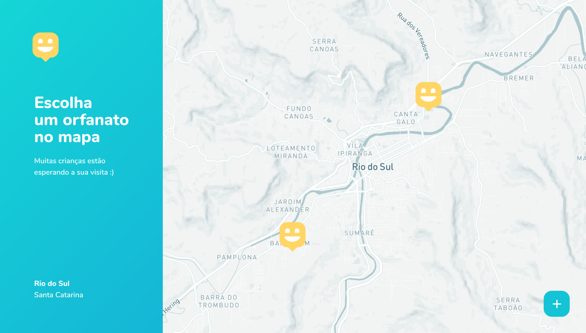
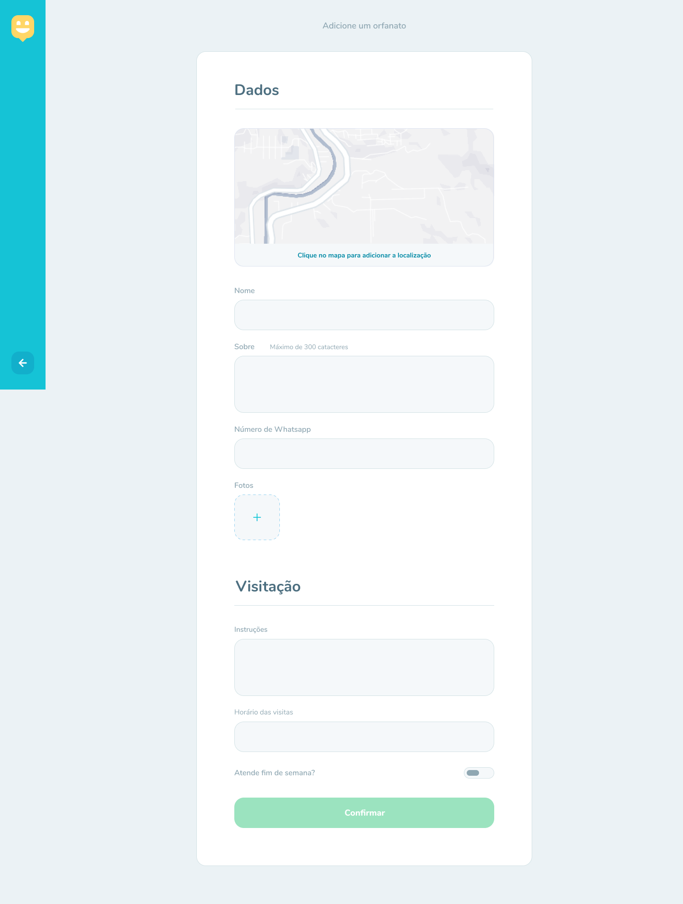
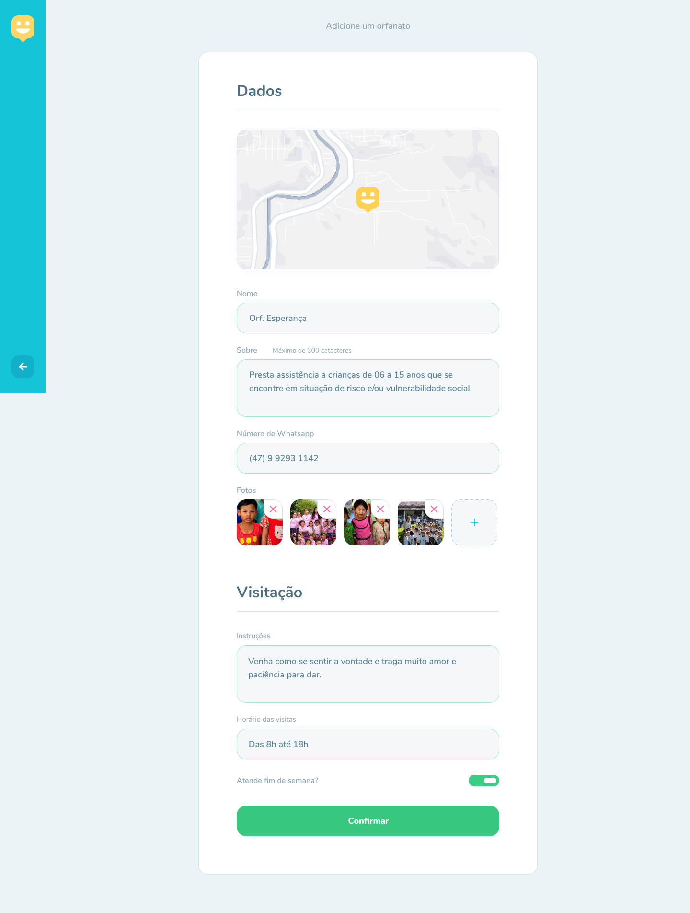
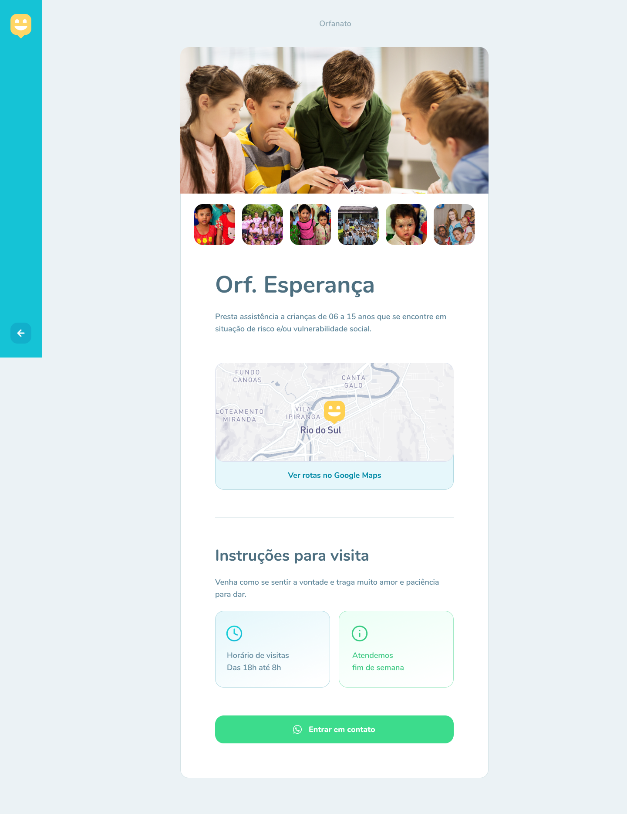
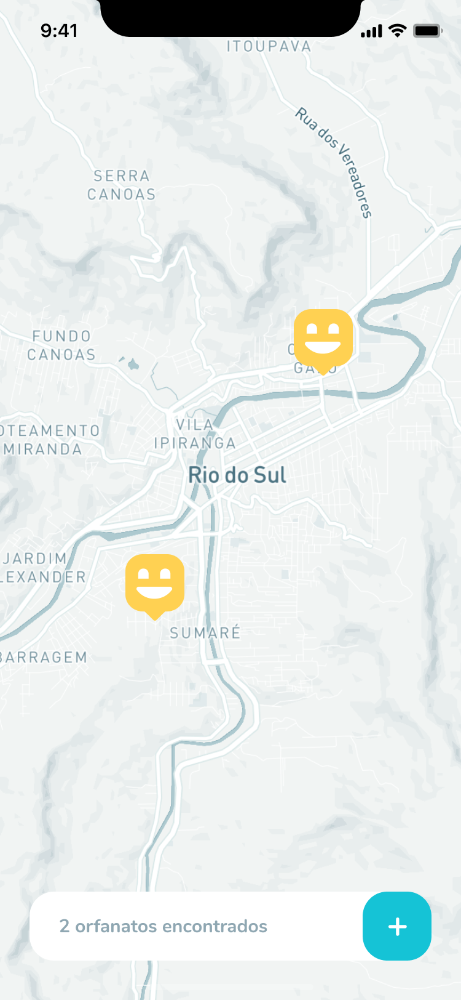
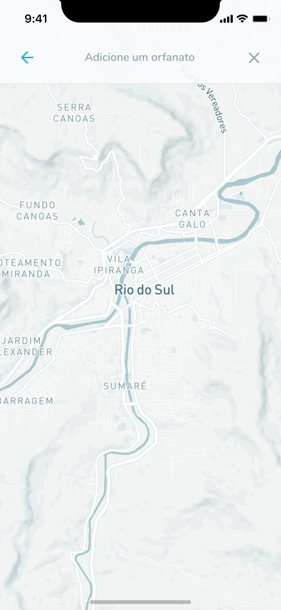
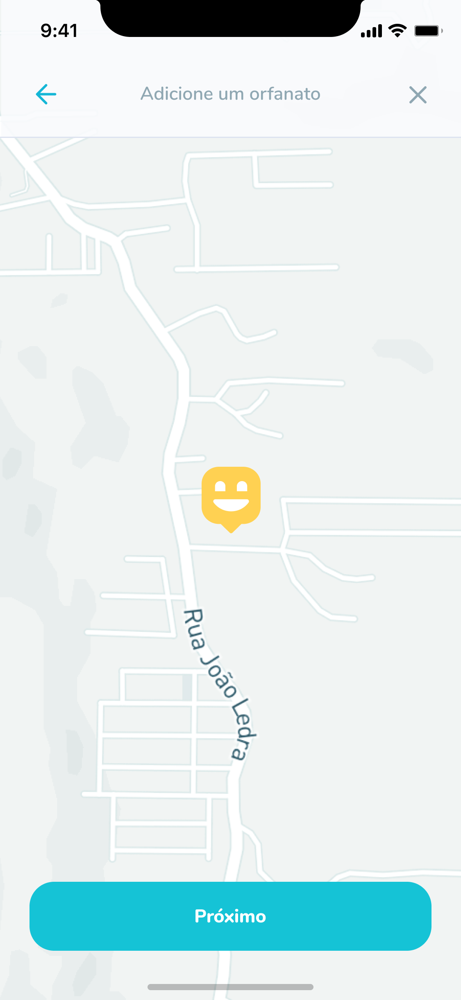
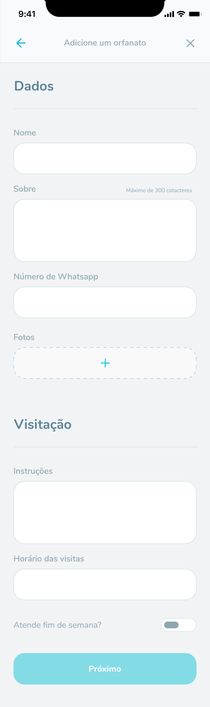

# 😀 Happy 😀

## ❓ Curiosidad ❓

### El nombre Happy es una combinación entre felicidad (happy en inglés) y aplicación (h-APP-y).

## 🏁 Objetivo 🏁

### La intención de esta plataforma es que las personas puedan visitar los diversos orfanatos que tengan en su región y así repartir felicidad a esos niños que tanto lo necesitan.

### con ese objetivo se desarrollará una plataforma tecnológica compuesta por un plataforma web y una aplicación móvil donde los usuarios podrán vizualizar en un mapa los diferentes orfanatos que tienen en su región.

### Estos orfanatos estarán indicados con un icono donde al seleccionar se podrá observar las reglas para visitar ese orfanato y sus horarios.

## 📸 Preview Versión 1.0 📸

## 👷 Para la cración de la plataforma tecnológica se utilizó 👷

### 🔧 Node.js

### 🔧 React

### 🔧 Typescript

### 🔧 TypeORM

### 🔧 SQLite

### 🔧 React-Native

### 🔧 Expo

## 🕺 Clona este repositorio 🕺

### 🗄️ Backend: Paso 1: Después de clonar el repositorio, extraerlo y abrirlo en VSCode debes hacer npm install (o yarn install) para instalar las dependencias que están en package.json. Luego debes ejecutar las migrations de la base de datos con el comando yarn typeorm migration:run donde se realizará 2 migrations. Al terminar esa configuración para hacer funcionar la api que esta en localhost:3000 es con el comando yarn dev y todo listo por aqui. 👌

### 🖥 Web: Paso 2: Debes abrir el backend en VSCode y hacer npm install (o yarn install) para instalar las dependencias que están en package.json. Luego ejecutas yarn start en la terminal integrada de VSCode y eso debería abrir una página en tu browser con la dirección localhost:3333. Para la función del mapa existen 2 opciones:

### 1. Comentar lineas de src/pages/OrphangesMap.tsx

#### <TileLayer

#### url={`https://api.mapbox.com/styles/v1/mapbox/light-v10/tiles/256/{z}/{x}/{y}@2x?access_token=${process.env.REACT_APP_MAPBOX_TOKEN}`}

#### />

### y descomentar

#### <TileLayer url="https://a.tile.openstreetmap.org/{z}/{x}/{y}.png"

#### />

### 2. Ir a https://www.mapbox.com/ luego crear una cuenta y buscar en tu Access tokens: Default public token. Copia ese pk... Luego anda a la Raíz del proyecto Web en VSCode y crea un archivo llamado solo .env y crearás esta variable dentro del .env: REACT_APP_MAPBOX_TOKEN=pk...(aqui pondrás tu token). Con esta configuración está listo al fin! 👌😅

### 📱 Mobile: Paso 3: Debes abrir la pasta mobile en VSCode y hacer npm install (o yarn install) para instalar las dependencias que están en package.json. Luego ejecutas yarn start en la terminal integrada de VSCode y eso debería abrir la página de expo. En la pasta services/api.ts del proyecto la url puede cambiar de acuerdo a tu red, entonces al prender tu expo client (en tu broswer) en LAN verificas si es la misma direccion que esta en api o si es otra (deberia cambiar por ser una LAN diferente). Despues de realizar esa configuracion solo prender tu emulador o tu dispositivo con qrcode y esta todo listo. 👌
